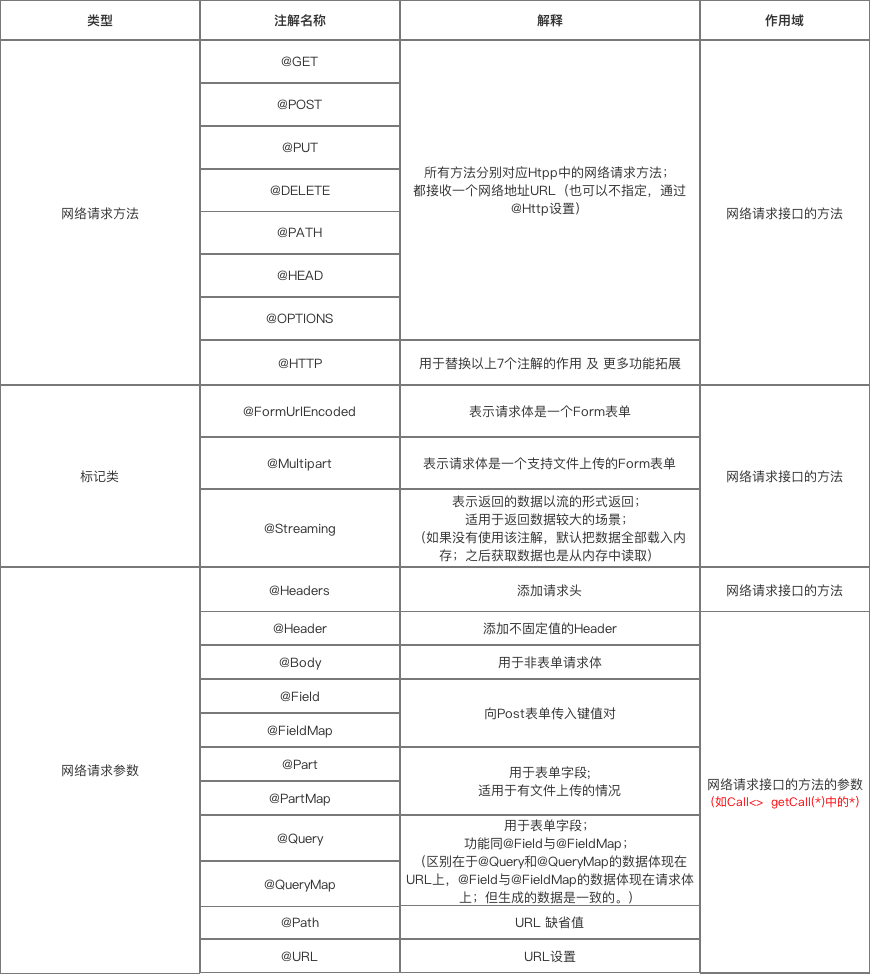

## 常见开源项目源码分析

### [OkHttp](./doc/module_open_projects/OkHttp.md)

### [Retrofit](./doc/module_open_projects/Retrofit.md)

Retrofit 注解



### [GlideV3](./doc/module_open_projects/Glide.md)

### [GlideV4](./doc/module_open_projects/GlideV4.md)

[GlideV4文档](https://muyangmin.github.io/glide-docs-cn/)


### [EventBus](./doc/module_open_projects/EventBus.md)

[EventBus文档](https://greenrobot.org/eventbus/)


### [Dagger2](./doc/module_open_projects/Dagger2.md)

[Dagger2文档](https://dagger.dev/)

#### DaggerAndroid

*注意: 使用dagger.android,必须导入dagger依赖,否则无法编译*

```Groovy
implementation 'com.google.dagger:dagger:2.26'
kapt 'com.google.dagger:dagger-compiler:2.26'

implementation 'com.google.dagger:dagger-android:2.24'
kapt 'com.google.dagger:dagger-android-processor:2.24'
```

#### HILT


### [RxJava2](./doc/module_open_projects/RxJava2.md)

### [Picasso](./doc/module_open_projects/Picasso.md)

### [LeakCanary](./doc/module_open_projects/LeakCanary.md)

### [BlockCanary](./doc/module_open_projects/BlockCanary.md)

### [AOP](./doc/module_arch/AOP.md)

